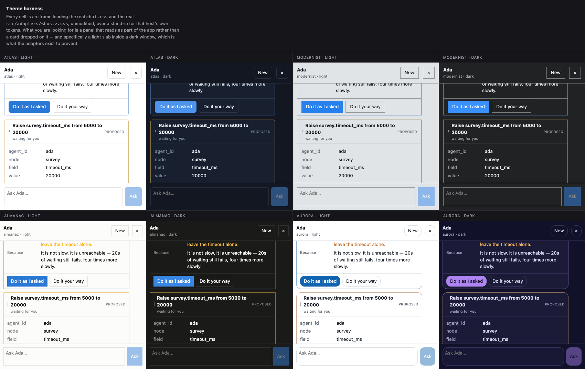
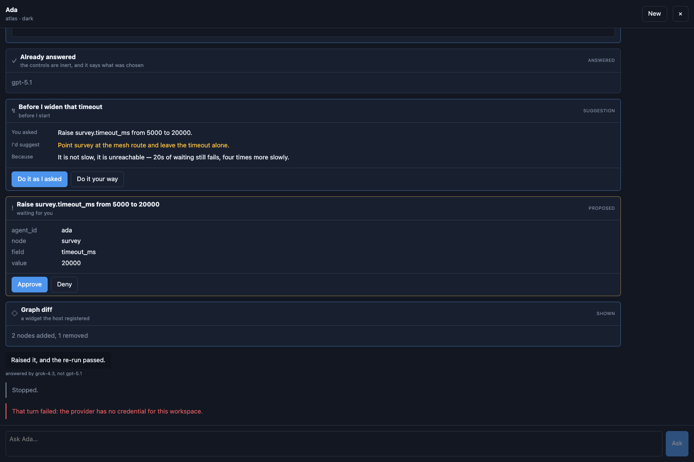

# react-agent-chat-window

**An in-app chat window for agent UIs.** A turn stream, a widget kit, a
composer, and a placement.

Deliberately **not** a transport, **not** a theme, and **not** an opinion about
your state library. Those four things are why most in-app chat panels cannot be
lifted out of the app they grew in.



```sh
npm install react-agent-chat-window
```

---

## The problem

An in-app agent panel starts as 200 lines and ends up welded to its host. It
imports the app's design primitives, reads the app's router, calls the app's
fetch wrapper, and stores turns in the app's global store. All four are
reasonable decisions on the day. Together they mean the next app writes its own.

So each of those is an extension point here instead:

| The weld | What this does instead |
|---|---|
| **The transport** | You pass a `ChatClient`. `createHttpChatClient` is one implementation, not a requirement. |
| **The theme** | ~40 `--cai-*` custom properties. An adapter file maps *your* design system's names inward. No CSS-in-JS, no provider. |
| **State** | `createChatStore` is a plain external store read with `useSyncExternalStore`. It does not know your app has Redux. |
| **Placement** | `ChatWindow` fills the box you put it in and positions **nothing** — no `position`, no `z-index`, no viewport units. `ChatDock` is offered separately if you want one. |

---

## Use it

```tsx
import { ChatWindow, createHttpChatClient, useChat } from 'react-agent-chat-window'
import 'react-agent-chat-window/chat.css'
import 'react-agent-chat-window/adapters/modernist.css'   // or write your own

const client = createHttpChatClient({ baseUrl: '/api' })

function Workspace() {
  const chat = useChat(client, 'ada')

  return (
    <div style={{ display: 'flex', minHeight: 0, flex: 1 }}>
      <main style={{ flex: 1, minWidth: 0 }}>…your app…</main>
      {chat.open && (
        <aside style={{ width: 420 }}>
          <ChatWindow
            store={chat.store}
            title="Ada"
            emptyState={chat.greeting}
            onClose={() => chat.setOpen(false)}
          />
        </aside>
      )}
    </div>
  )
}
```

`ChatWindow` is the whole thing. It fills its container, and the container is
yours — a flex child, a drawer, a portal, a grid cell. That is the difference
between a component you can place and a component that places itself.

### Not a React app?

A Flask app, a Rails view, a static page: add a div, three stylesheets and a
script tag.

```html
<link rel="stylesheet" href="/static/chat.css" />
<link rel="stylesheet" href="/static/adapters/modernist.css" />
<div id="chat"></div>
<script src="/static/chat.iife.js"></script>
<script>
  AgentChat.mountChat('#chat', { agentId: 'ada', title: 'Ada', baseUrl: '/api' })
</script>
```

The IIFE build inlines React, so the page needs no build step and no `process`
shim. Same window, same widgets, one implementation.

---

## The widget kit

An agent that can only emit prose has to describe a choice instead of offering
one. The turn stream renders structured widgets inline, so a proposal is a pair
of buttons rather than a paragraph asking you to type "yes".



Built in: forms and fields, option pickers, metrics, tables, step timelines,
code blocks, proposals with approve/deny, and suggestions ("you asked for X;
I'd do Y, because Z") that keep both paths clickable.

Register your own for anything app-specific:

```tsx
const widgets = {
  'graph.diff': ({ payload }) => <GraphDiff added={payload.added} removed={payload.removed} />,
}

<ChatWindow store={chat.store} widgets={widgets} />
```

App-specific cards stay **inside** the stream rather than bolted beside it,
which is the point — the conversation stays the record of what happened.

### Client tools

Tools the *browser* holds, declared on **every turn**:

```tsx
<ChatWindow store={chat.store} tools={declareTools({
  'ux.highlight': { description: 'Point at something on screen the user is asking about', run: (args) => highlight(args.selector) },
})} />
```

Per turn, not per session: in a routed app the tools that make sense over a
canvas are not the ones that make sense in a library, and a set declared once
goes stale the first time somebody navigates. There is deliberately no `effect`
field — a client tool acts only on the browser it came from, and that bound is
what makes accepting a browser-declared tool safe at all. A client tool that
performs a network write is a server tool wearing the wrong hat.

---

## Theming

Every `--cai-*` hook resolves **once** into a private role, and the component
paints only from the roles. To theme it, write an adapter: custom properties
and nothing else, mapping your names **into** `--cai-*`.

```css
/* my-app.css */
:root {
  --cai-bg: var(--panel, #fff);
  --cai-text: var(--ink, #111);
  --cai-accent: var(--brand, #2a78d6);
}
```

**Always map inward, never outward.** Write `--cai-bg: var(--panel)`, never
`--color-surface: var(--panel)`. An app that applies its theme as inline style
on `<html>` beats an author stylesheet, so a rule redefining the *host's* own
name is silently ignored there. Mapping into this package's vocabulary is the
only direction that holds in every host — and it follows a live theme switch for
free, because every `var()` is substituted at use.

Give each host token a literal fallback and a build missing one still renders a
window instead of an unstyled box.

Four adapters ship as worked examples, chosen because their token vocabularies
are structurally different: `atlas` (a conventional `--color-*` system),
`almanac` (`--page` / `--surface` / `--ink`), `aurora` (oklch, with translucent
frosted panels), and `modernist` (deliberately sparse — the adapter derives
every role the host does not define).

### The theme harness

```sh
npm run harness
```

Eight iframes: four design systems × light and dark, each loading the **real**
`chat.css` and the **real** adapter at `:root`, exactly as an app would. If an
adapter only works when its selector is rewritten, it does not work. That
screenshot at the top of this page is the harness.

---

## API

| Export | What it is |
|---|---|
| `ChatWindow` | the window — header, turn stream, composer. Fills its container. |
| `useChat(client, agentId)` | one store per (client, agent), plus `open`/`setOpen` and the agent's declared greeting |
| `createChatStore(client, agentId)` | the store on its own, for a host that owns the React tree |
| `createHttpChatClient({ baseUrl, headers })` | the bundled transport; swap it for anything matching `ChatClient` |
| `mountChat(el, options)` | mount into a non-React page |
| `ChatDock` · `ChatLauncher` | optional placement — `right`, `bottom` or `floating` |
| `Composer` · `MessageList` · `Widget` | the pieces, if you want to compose your own window |
| `declareTools` · `widgetFor` | client-tool and widget registries |

The wire types (`TurnEvent`, `WidgetSpec`, `AgentCard`, `ClientTool`, …) are
exported from the package root. `src/wire.fixture.json` is a committed sample
response the contract tests assert against, so a server implementation has
something concrete to match.

---

## Develop

```sh
npm install
npm test        # 114 tests
npm run typecheck
npm run harness # the theme harness on :5173
npm run build   # dist/index.js (ESM) + dist/chat.iife.js (standalone)
```

---

## License

MIT © David Hook
